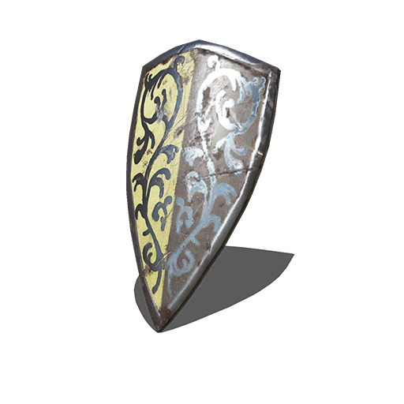

#  Grass Crest Shield Firewall Applet

A custom Dark Souls–themed tray icon for the Cinnamon `firewall-applet`.

This project modifies the default `firewall-applet` to use a Grass Crest Shield icon in the system tray.

## Installation
1. Clone this repository or download the files manually:

   ```
   git clone https://github.com/hhiruko/grass-crest-shield-firewall-applet.git
   cd grass-crest-firewall-applet
   ```

2. First, back up the original `firewall-applet` in case you ever want to restore it:

   ```
   sudo cp /usr/bin/firewall-applet /usr/bin/firewall-applet.bak
   ```

3. Then copy your modified version into place:

   ```
   sudo cp firewall-applet /usr/bin/firewall-applet
   sudo chmod +x /usr/bin/firewall-applet
   ```

4. Place the icon PNG file at:

   ```
   mkdir -p ~/.icons/firewall-applet
   cp firewall-applet.png ~/.icons/firewall-applet/firewall-applet.png
   ```

5. To apply changes:

   ```
   pkill firewall-applet
   nohup firewall-applet >/dev/null 2>&1 &
   disown
   ```

## License

This project is licensed under the GNU General Public License v2.0 or later (GPL-2.0-or-later).
>The original firewall-applet is part of <b>FirewallD</b> and is also licensed under GPL v2.0 or later.

## Acknowledgments

- [Cinnamon Desktop Environment](https://github.com/linuxmint/cinnamon)
- [FirewallD](https://github.com/firewalld/firewalld)
- [FromSoftware](https://www.fromsoftware.jp/ww/), for the Dark Souls universe

